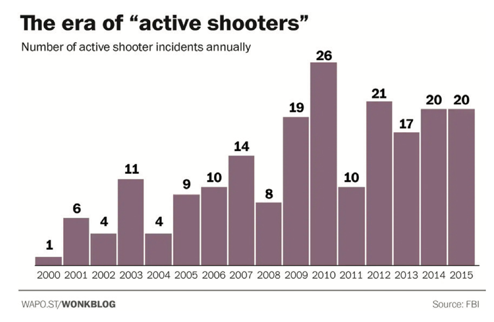

# Markdown Report

## By Brian Tran

*04/07/2022*

## Data Viz Summary
The data visualization is a bar graph made by Christopher Ingraham for the Washington Post to accompany the increasing rate of active shooter incidents in the United States between 2000 and 2015. The graph was made using data retrieved from the FBI - Federal Bureau of Investigation - about the number of active shooter incidents annually. Based on the trend of the bar graph data, it can be predicted that as the years go on, the active shooter incidents annually will increase. This means more people are being killed per year by guns and their years left on earth have been lost.

## Data Viz Biography
1. **Who or what institution produced the visualization?**
The Washington Post produced and published the visualization
2. **Who or what institution produced the visualization?**
The visualization was produced in June 2016.
3. **Who is the audience for the visualization? Who might be impacted, either directly or indirectly, by the visualization?**
The primary audience is the readers (general public) who reads the blogs and articles published by the Washington Post. The people of The United States might be directly impacted by the visualization; they might want to take action in order to stop lives from being taken away and decrease the amount of active shooter incidents
4. **What values, goals, or interests are at stake with the visualization?**
The goals with the visualization is to communicate and inform to people that active shooter incidents are increasing annually. The interest might be the people and law makers of the United States as they might interperet the data differently.
5. **What can be learned from the visualization?**
From the visualization, it can be learned that the amount of active shooter incidents annually in the United states have been increasing since the year 2000.
6. **What issues, if any, related to power and justice are reflected in the data visualization?**
One of the main issues reflected in the data visualization is what is the cause of the active shooter incidents. Is it the type of gun or is the person with a mental illness. Guns can be used to stop the bad guy. Another important thing to factor is the Constitution of United States of America; In particular the second amendment which is A well regulated Militia, being necessary to the security of a free State, the right of the people to keep and bear Arms, shall not be infringed. But right now, active shooter incidents are still increasing unless action is taken.
